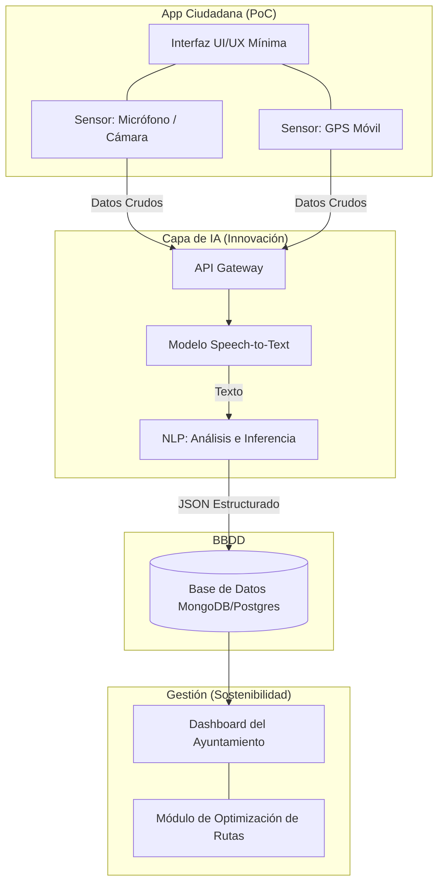
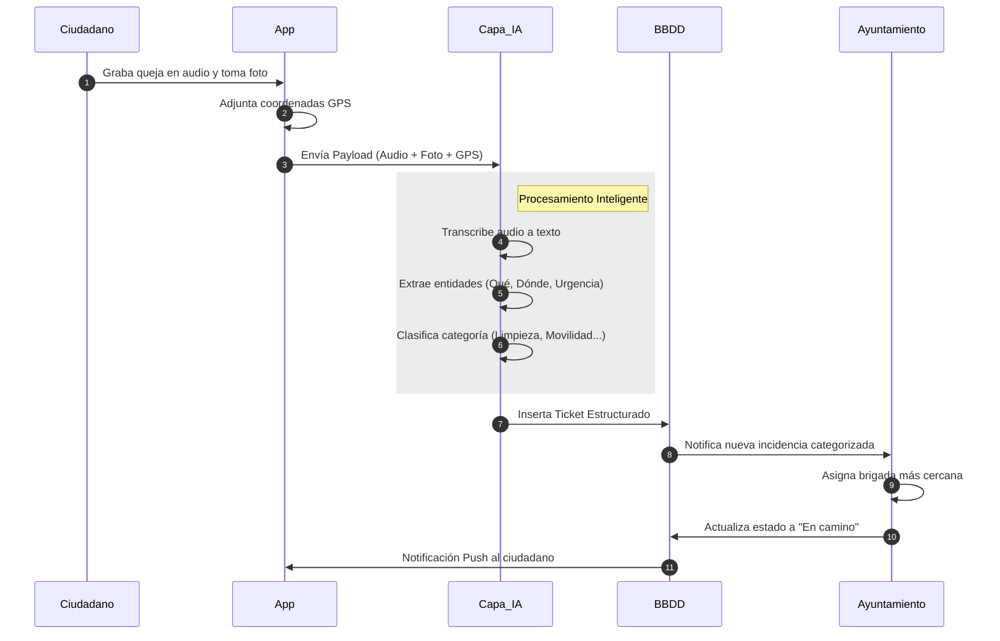

# Reto #22: Transformación de Quejas Ciudadanas

## 1. Definir bien el problema
*   **Usuario objetivo:** Vecino que detecta una incidencia en la vía pública pero no tiene tiempo o ganas de rellenar formularios burocráticos largos.
*   **Caso de uso concreto:** Un ciudadano ve basura acumulada fuera de un contenedor, le hace una foto, graba un audio de 5 segundos quejándose, y la app lo convierte en un ticket formalizado.
*   **Contexto urbano:** Ciudad o barrio con incidencias frecuentes de mantenimiento (limpieza, mobiliario, movilidad) donde el Ayuntamiento recibe quejas desestructuradas por redes sociales o teléfono.

## 2. Diseñar la solución tecnológica
*   **Arquitectura:** 
    *   **App:** Interfaz móvil del ciudadano.
    *   **Sensores:** GPS del móvil (ubicación automática) y cámara/micrófono.
    *   **API + IA:** LLM (ej. OpenAI Whisper + GPT-4) para transcribir el audio, limpiar el tono de queja y estructurar los datos.


**Justificación arquitectónica:** Se plantea un modelo *Thin Client* (Frontend ultraligero). La innovación técnica reside en delegar toda la carga cognitiva a la capa de IA en la nube. Esto permite que la app sea rápida y compatible con dispositivos móviles antiguos, garantizando la inclusión digital. Al eliminar los formularios tradicionales, reducimos la barrera de entrada para la participación ciudadana.

*   **Flujo de datos:** Origen (Cámara/Micro de la App) -> Procesamiento (API extrae texto e intención) -> Almacenamiento (Base de datos de tickets) -> Visualización (Dashboard del Ayuntamiento para gestión).



**Justificación del flujo:** El diseño es asíncrono. El ciudadano envía el *payload* en segundos y continúa su día. La IA actúa como filtro inteligente 24/7, evitando que lleguen quejas duplicadas o incomprensibles al backoffice. A nivel de sostenibilidad, estructurar los datos desde el origen permite al Ayuntamiento alimentar directamente su módulo de optimización de rutas, reduciendo desplazamientos innecesarios y la huella de carbono de sus vehículos.

*   **Lógica principal:** El motor de reglas (IA + Heurística) extrae la intención del texto natural y aplica un árbol de decisión automatizado para la categorización (clasificación de tickets) y priorización (análisis de sentimiento/urgencia).

    ```mermaid
    graph TD
        A[Texto Estructurado por IA] --> B{¿Contiene palabras clave?}
        
        B -->|basura, contenedor, olor| C[Categoría: Limpieza]
        B -->|semáforo, bache, coche| D[Categoría: Movilidad]
        B -->|farola, banco, parque| E[Categoría: Mobiliario Urbano]
        
        C --> F{¿Urgencia/Peligro?}
        D --> F
        E --> F
        
        F -->|Alta ej. cristal roto| G[Notificar Brigada Inmediata]
        F -->|Baja ej. grafiti| H[Añadir a Cola de Mantenimiento Regular]
    ```

## 3. Prototipo de app (Prueba de Concepto - PoC)

Para el desarrollo del prototipo, se ha priorizado una interfaz **"Voice-First" (prioridad a la voz)** y de fricción cero. Esto fomenta la inclusión digital, permitiendo que cualquier ciudadano, independientemente de sus habilidades tecnológicas o edad, pueda reportar incidencias sin enfrentarse a formularios complejos.

*   **Enlace al prototipo interactivo (Figma):** *[Insertarás el link aquí cuando lo tengamos]*
*   **UI navegable:** Flujo lineal de 3 pasos enfocado en la conversión rápida.

### Justificación de las Pantallas Principales:

1.  **Pantalla de Inicio (Omnicanalidad y Asincronía):** 
    *   **Diseño:** Mapa interactivo con un pin de ubicación editable. En la parte inferior, un botón central de voz, botón de cámara y una **barra de texto tradicional**.
    *   **Razonamiento:** La barra de texto garantiza la accesibilidad para usuarios con discapacidad vocal o en entornos ruidosos. Además, permitir mover el pin del mapa facilita el **reporte asíncrono** (el ciudadano puede tomar la foto in situ y enviar el reporte más tarde desde su casa, modificando la ubicación).

2.  **Pantalla de Detalle y Confirmación (Transparencia de IA):**
    *   **Diseño:** Tarjeta con la información estructurada que la IA ha extraído (Categoría, Urgencia, Descripción, Dirección). Incluye botones para editar.
    *   **Razonamiento:** Mantiene al "humano en el bucle". Si el usuario reporta desde otra ubicación, la IA lee los metadatos GPS de la foto (si la hay) o permite la corrección manual antes de enviar, evitando falsos positivos al Ayuntamiento.

3.  **Pantalla de Perfil y Alertas (Trazabilidad):**
    *   **Diseño:** Línea de tiempo visual del estado del ticket (Enviado -> En proceso -> Resuelto). 
    *   **Razonamiento:** La transparencia reduce la frustración ciudadana e incentiva la participación recurrente.

## 4. Lógica básica simulada
*   **Pseudocódigo o reglas simples:**
    ```text
    RECEIVE input_audio, ubicacion_gps
    texto_crudo = AI_TRANSCRIPT(input_audio)
    ticket_estructurado = AI_EXTRACT(texto_crudo)

    IF ticket_estructurado.tema == "basura" OR "contenedor" THEN
        area = "Limpieza"
    ELSE IF ticket_estructurado.tema == "semáforo" OR "bache" THEN
        area = "Movilidad"
    ELSE
        area = "Mantenimiento Urbano"
        
    SAVE ticket TO database(area, ubicacion_gps)
    ```
*   **Demo tipo "simulada":**
    *   *Datos ficticios (Input):* Audio ciudadano: "Lleva el contenedor de la calle Mayor desbordado tres días, huele fatal y está lleno de moscas".
    *   *Resultado esperado (Output):* 
        *   Título: Contenedor desbordado
        *   Categoría: Limpieza
        *   Urgencia: Alta (motivo: riesgo salubridad/olores)
        *   Derivado a: Área de Limpieza.
